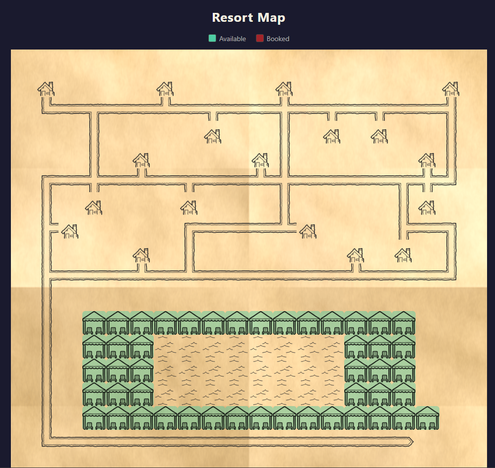

# Resort Map - Interactive Cabana Booking

A web application for browsing an interactive resort map and booking poolside cabanas. Built with TypeScript - Express backend + React frontend.

## Quick Start

**Prerequisites:** Node.js 18+

```bash
# Single command to build and launch everything:
./run.sh

# With custom map and bookings files:
./run.sh --map /path/to/map.ascii --bookings /path/to/bookings.json
```

The app opens at **http://localhost:3001**.

Alternatively, if you prefer npm directly:

```bash
npm run install:all    # install deps for server and client
npm start              # builds both and starts the server
npm start -- --map ./map.ascii --bookings ./bookings.json
```

## How It Works

- The backend reads the ASCII map file and parses each character into a typed grid cell. Every `W` cell gets a unique ID (`cabana-1`, `cabana-2`, etc.). Path tiles (`#`) are analyzed by checking their neighbors to determine the correct tile variant (straight, corner, crossing, etc.) and rotation.
- The frontend fetches the map data from the API, renders a responsive CSS grid of tiles using the PNG assets, and makes cabana tiles clickable. On smaller screens the tile size scales down automatically to fit the viewport.
- Clicking an available cabana opens a booking modal. The guest enters their room number and name - the backend validates this against the bookings file. On success, the cabana turns red on the map. Clicking a booked cabana shows an "unavailable" message.
- Bookings are stored in-memory on the server - no database needed.

## Project Structure

```
server/          Express API (TypeScript)
  src/
    index.ts           Entry point, CLI args, static serving
    types.ts           Shared type definitions
    routes/api.ts      GET/POST /api/cabanas
    services/
      mapParser.ts     ASCII map parsing + path tile logic
      booking.ts       Booking validation and state
client/          React SPA (Vite + TypeScript)
  src/
    App.tsx            Root component
    api.ts             API client functions
    components/
      ResortMap.tsx     Map grid rendering
      MapTile.tsx       Individual tile with asset mapping
      BookingModal.tsx  Booking form / unavailable message
assets/          PNG tile images
maps/            Maps folder
bookings/        Bookings folder
run.sh           Single entrypoint script
```

## API Endpoints

| Method | Endpoint | Description |
|--------|----------|-------------|
| GET | `/api/map` | Returns full map grid + cabana list with booking state |
| GET | `/api/cabanas` | Returns all cabanas with availability |
| GET | `/api/cabanas/:id` | Returns info for a specific cabana |
| POST | `/api/cabanas/:id/book` | Book a cabana (body: `{ room, guestName }`) |

## Running Tests

```bash
# All tests (server + client):
npm test

# Server tests only:
cd server && npm test

# Client tests only:
cd client && npm test
```

Tests use **Vitest** with **supertest** for API integration tests and **React Testing Library** for component tests.

**Server tests** cover: map parsing, path tile detection, guest validation, booking logic, and full API request/response flows.

**Client tests** cover: map rendering, loading/error states, cabana click interaction, booking form validation, API success/failure handling.

## Screenshot



## Design Decisions

I chose Express + React as a straightforward TypeScript stack - minimal setup, widely understood, and sufficient for the scope. The map parser runs once at startup and builds an in-memory grid; the path tile algorithm checks 4 neighbors to pick the right sprite and rotation, which keeps things simple without needing a tilemap library. If a chalet (`c`) is directly adjacent to a path tile, that path tile's shape accounts for the connection (e.g. a straight becomes a split) - chalets further away don't get artificial branches. Bookings live in a `Map<string, CabanaInfo>` on the server - no persistence needed per the requirements. Guest name validation is case-insensitive. The frontend is a single-page app that Vite builds into static files, served by Express in production. The map grid is responsive - tile size adjusts to fit the viewport on mobile. For dev, Vite proxies API calls to the backend. I kept the booking flow minimal (one modal, two fields) to stay close to the spec without over-engineering.
